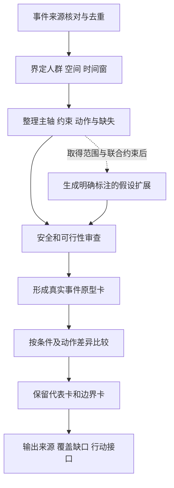

# 虹桥疏运情景生成方法方案（T-A6）

任务主责：张子凡。整理日期：2026年10月9日。状态：阶段方法稿，待万岩松审核A4/A5接口。按[数据可得性建议](../02_数据与案例/数据可得性与路线建议-T-C4补充.md)设计可用于D4的描述性流程，同时保留数据补齐后的扩展方法。D4尚是建议，本文不代替团队路线决定。

2026年10月10日更新：用户确认本次按“描述性情景库＋方法框架”收尾，主范围为虹桥火车站夜间晚点旅客继续疏运；团队和导师尚未确认。可直接阅读[卡集](描述性情景卡集-v1.md)、[覆盖矩阵](情景覆盖矩阵-v1.md)、[字段框架](../04_建模/数据字典与方法框架-v1.md)和[动作接口](../05_协同调度/情景到协同动作接口-v1.md)。本次助手补充不替代万岩松本人复核。

## 一 目标与研究边界

情景生成的对象是事件下的运营条件组合：特定人群、时间窗及空间内的需求输入、可服务能力、准备信息和安全约束。生成接驳线路或车辆排班属于后续策略任务，与生成事件情景分开。

初期以虹桥火车站到达旅客继续疏运为对象。以E01降雪、E02地震影响晚点为真实原型，以G01节假日集中到达作对照，E03台风保障作安全边界检查，P01作为事前计划参考。来源及统计口径沿用[案例台账](../02_数据与案例/案例与来源台账-T-C4初稿.md)。全枢纽或其他事件扩展需重新核人群、边界和处置范围。

阶段目标是可追溯的情景卡、生成规则、覆盖缺口及行动接口。现阶段不生成绝对等级、不运行优化仿真、不给出发生概率。

## 二 方法比较与选择

| 方法 | 输入条件 | 优点及局限 | 本阶段使用方式 |
|---|---|---|---|
| 真实案例归纳 | 可核的事件、动作、字段及缺失记录 | 能保持来源和约束；公开案例少且有选择偏差，不能代表所有事件 | 主方法；按事件去重，保留未知项，不按报道篇数计样本 |
| 规则驱动组合 | 有依据的状态定义、相互关系及可行规则 | 便于检查动作差异和边界；任意组合会产生不可能状态 | 先形成待检验的规则清单；扩展组合一律标假设 |
| LHS参数抽样 | 每个数值变量的范围、转换依据及联合约束 | 在设定参数空间内分层抽样；本身不证明范围真实或组合可行 | 暂不实施；取得取值依据后再比较抽样方案 |
| K-Means归并 | 可比较的数值特征、样本及明确距离意义 | 可归并相近样本；中心未必是可执行情景，罕见边界可能被平均掉 | 暂不实施；不对现有几个异质条目强行聚类 |

LHS的分层针对各一维边际，不能自动保证业务约束或已知相关结构。若抽样后筛除大量组合，应记录原因并重新设计条件抽样；筛除后不能继续宣称保持原抽样性质。[SciPy方法说明](https://docs.scipy.org/doc/scipy-1.17.0/reference/generated/scipy.stats.qmc.LatinHypercube.html)

K-Means依赖数值空间内的距离与中心，尺度及几何结构会影响归并。人数、小时、方式集合、权限状态和“未知”不能直接混成原始欧氏特征。标准化不会自动解决类别变量、缺失和业务权重问题。[scikit-learn聚类说明](https://scikit-learn.org/stable/modules/clustering.html)

以上为方法条件比较，不代表这些方法在虹桥的效果已经验证；具体算法优劣须在同一有效输入集上比较。

## 三 生成与筛选流程

1. **核来源与去重。** 保留事件ID、原文、日期和字段出处；同一事件多报道合并。不同方式、时段可作为事件内记录，不作为独立验证样本。
2. **固定边界。** 说明旅客何时进入待疏运系统、何时算离开，是否含内部换乘及自组织离开。未确认时写明局限，不进行跨案例数值排序。
3. **提取字段。** 使用A4的P1、U、D、Q_aff及R定义，另列初始滞留、方向服务、τ_m、道路场站、安全与权限。将报道事实、预测、计划、推算、假设、缺失分开。
4. **先审约束。** 发现矛盾时回查来源或排除假设组合；安全或权限未知时列待确认，不当默认正常，也不直接断言实际不可行。
5. **形成原型卡。** 原样保留可用线索，不将受影响人数变成需求、不将实际运量变成能力、不将等待时间变成τ_m。
6. **比较和选择。** 比较服务条件与动作差异；即使归为同类，仍保留事件卡与来源。E01/E02可同属晚点类，不能因此合为一个验证事件。
7. **登记覆盖缺口。** 输出已覆盖条件与缺证条件，并为下一轮补数据或新增案例列任务。

## 四 约束筛查规则

| 编号 | 检查对象 | 处理规则 |
|---|---|---|
| C01 | 人群与流量守恒 | 同边界按初始滞留、进入、实际离开核查；中间接驳人次不重复计最终疏运人数 |
| C02 | 方式和道路可用性 | 已确认封闭的道路不配置经过该段的服务；未知路况列待核，不能直接假设满额能力 |
| C03 | 到位时间 | 新增服务生效前不计其能力；τ_m缺失时不算最迟下令时间 |
| C04 | 方向与停靠 | 不服务旅客目的地且无可行接续的线路，不当作该方向可替代能力 |
| C05 | 资源与场站 | 核车辆、人员、周转、泊位及装载；同一资源不重复承诺给同时段冲突任务 |
| C06 | 安全与授权 | 实际禁用方式先排除；未知授权只输出询问/确认需求，不输出自动执行指令 |
| C07 | 输入与结果 | B_max、T_clear属于结果指标；不得将报道完成时点直接当完整清空时间或把结果用于事前分类造成信息泄漏 |
| C08 | 跨事件口径 | 不以2026年设施配置补2023年能力，不用常态全天车辆数补夜间事件运量 |

假设扩展筛查结果分为“通过已列规则”“违反规则”“信息不足”。通过仅说明未违反当前规则，不等于已经验证可执行；信息不足不纳入定量策略比较，但可保留为数据需求卡。

## 五 初始情景卡

以下是依据现有资料形成的描述性原型，数量由可用条目决定，不是已证明的最小充分集。详细数值保留在案例台账，避免在卡中产生不同口径版本。

| 情景ID／角色 | 条件与来源 | 已发生动作或计划 | 研究输出与未知项 |
|---|---|---|---|
| SC-E01／晚点事件原型 | E01：降雪影响夜间列车抵沪；有报道窗口、受影响人数和中心下令时点 | 实际：地铁延时加开、夜宵公交加密、出租动员、广播和现场监管 | 描述多方式准备及执行链；P1/U/D/Q_aff/完整R不能直接赋值，需求能力和τ_m待补 |
| SC-E02／晚点事件原型 | E02：地震影响列车抵沪；出租企业公开动员线索 | 报道实际：多渠道驾驶员动员、现场调度、末班旅客完成报文 | 保留与E01不同事件身份；全天车辆数不赋值应急能力，跨方式信息缺失 |
| SC-G01／常态对照 | G01：返程集中到达；含预测、计划与报道实绩 | 实际：出口和上客空间分流；计划：地铁定点加开 | 比较事前准备及方向限制，不能把计划当执行或与E01直接比效果 |
| SC-E03／安全边界卡 | E03：台风期间设施检查及安置准备 | 已报道：设施加固、休息区保障、滞留点准备 | 提示“继续疏运或安置”的安全前提；不推定实际启用、不赋值全部方式损失 |
| RF-P01／计划参考卡 | P01：国庆预测及方向性保障安排 | 计划：公交与铁路末班衔接、方向性专线 | 提供动作候选与方向字段；不计实际事件、校准或验证样本 |

四张情景原型卡加一张计划参考卡只表示当前交付条目。按本次用户确认的写作范围，SC-E03仅作安全边界，SC-G01作常态对照；团队和导师范围确认仍待完成。它们不能统称五个突发事件样本。逐卡事实、缺失和研究问题见[卡集](描述性情景卡集-v1.md)。

单卡后续补字段：版本、事件ID、统计边界、观测窗口、P1/U/D/Q_aff/R及其证据属性、补充约束、已发生动作、建议动作、授权待确认、拟评价指标、缺失项、复核记录。未知值保留NA；若加入假设另分配SC-H编号并记录父事件及修改字段。

## 六 极端情景与数量选择

将安全限制、新增能力不可用、方向不可达、准备时间不足或信息迟获等条件列为**待覆盖的边界问题**，不声称已由现有案例覆盖。取得依据后单独保留相应案例或假设压力测试，不能因聚类规模小而删除；没有发生频率数据时不称其为“低概率”。

建议用覆盖矩阵决定是否增加情景，而不是预定6—8个：逐项检查晚点输入、常态接续、方向适配、到位滞后、空间瓶颈、安全与安置、信息未知等条件，记录“已有证据”“部分线索”“未覆盖”。新增条目应带来可解释的条件或动作差异；纯粹规模变换但不改变任何分析问题的条目，可保留在参数附表。

停止扩充的阶段条件是：本阶段拟回答的问题都有情景支撑或明确缺口，每张保留卡有来源或假设标记，安全边界未被遗漏，团队能解释保留/合并理由。该条件只是阶段交付检查，不证明全空间完备；情景数量随证据与问题范围更新。

## 七 数据补齐后的扩展与验证

描述性路线下，可按有来源的条件、约束和动作形成定性对照矩阵；未知项单列，不自动生成有序等级。进入数值抽样前，由A4/A5共同确认变量范围、联合关系和不可行规则，不从新闻数量级创造绝对阈值。

若开展LHS，先在条件化参数空间生成候选，再筛查并记录拒绝原因、随机种子、样本量及取值转换。若开展聚类，先核缺失处理、尺度、类别编码、权重及距离；比较多个簇数、初始化和代表选择，优先保留可执行候选样本，并对安全边界单独检查。情景覆盖、动作差异和稳定性均需评估，不能只按聚类误差选择数量。合成簇占比描述抽样设计，不代表真实发生概率。

验证按事件划分。已用来调整生成规则或阈值的事件不能再称独立验证事件；同事件的多条记录同组处理。当前E01/E02已经用于原型设计，后续若验证整套生成方法的外部泛化，应另留未用于设计的事件。算法运行和指标评估属于后续路线确认后的工作。

## 八 行动接口与阶段验收

| 对接任务 | 本方案提供 | 需对方确认 |
|---|---|---|
| A4维度与约束 | 主轴/补充约束字段、缺失处理和筛查表 | 定义、边界及安全覆盖 |
| A5候选判据 | 输入与结果分开，能力和τ_m不跨口径赋值 | 指标可算条件、校准及检验设计 |
| C4案例 | 事件身份、原型卡及补数字段 | 来源、人数与车辆统计口径 |
| 后续协同调度 | 候选准备、资源询问、旅客引导等动作接口 | 正式权限、可承诺资源、生效及终止条件 |

当前交付已包含方法比较、可追溯流程、约束筛查、详细情景卡、覆盖缺口、边界保留及数量选择理由。覆盖矩阵是资料检查，不是完备性或泛化验证；定量生成、独立检验和人工接口复核未完成，不写成正式操作预案。

实际复核人、日期、通过项及遗留问题：待万岩松完成后填写。团队主路线及事件边界决定：待T-A7实际评审。
