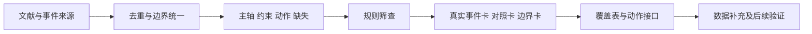

# 虹桥火车站夜间晚点旅客继续疏运：描述性情景库与方法框架

阶段研究报告｜版本：2026年10月10日｜状态：内容收尾稿，供团队与导师审阅

本报告汇总当前可成立的研究问题、证据、情景与方法接口。用户已确认本次路线和写作范围，数据限于公开资料及现有文件；团队及导师尚未确认。数值模型、绝对分级、调度求解与独立效果验证尚未开展。决定与责任状态见[阶段决策记录](../项目管理/阶段收尾与决策记录-2026-10-10.md)。

## 摘要

夜间列车晚点会改变旅客抵达枢纽与城市交通接续的时间关系。已有公开记录能够确认虹桥多方式保障、企业动员、信息引导及现场组织，但不足以复原同口径的需求、服务能力和响应全过程。本研究据此构建描述性情景库：按事件去重，固定人群、空间和时间口径，以信息提前量、到达不确定性、冲击持续时长、受影响疏运需求、方式与空间影响为候选信息维度，并保留供给、安全、方向、场站和权限约束。当前形成两张夜间晚点事件卡、一张常态高峰对照卡、一张台风安全边界卡及一张计划参考卡，附覆盖缺口、数据字典和条件化动作接口。研究成果是可追溯的案例组织与方法框架，尚不能据此确认最小完备维度、绝对等级或调度效果。

## 一 研究问题与范围

主对象为虹桥火车站夜间晚点到达、需要通过城市交通继续出行的旅客。研究三个相互衔接的问题：

1. 如何把事件报道转为统一人群、边界和窗口下的需求及约束信息？
2. 不同方式的服务方向、资源兑现和时间条件怎样进入同一情景？
3. 情景信息怎样支持有依据的准备、协调、资源确认和旅客引导讨论？

初期不扩展为整个枢纽所有灾害的救援模型。台风案例保留安全与安置分支，节假日材料作对照，计划材料用于说明动作字段。到达楼外、抵达上客点、实际离站和到达最终目的地分别定义；临时安置不等同于完成继续疏运。

虹桥已有跨主体保障机制及HOC/ERC信息联动、预警和电子预案。公开数据不足反映本组尚未取得可用记录，不证明运营方缺少这些能力。本课题的问题来自证据组织和研究接口，不以“原有体系不存在或失效”立论。[官方智慧治理材料](https://www.gzw.sh.gov.cn/shgzw_zxzx_gqdt/20250521/1eba1014906d4ab8ac405dd6f1dce619.html)。政策及规模论证见[背景](../01_文献资料/研究背景-T-C1.md)和[适用边界](../03_情景库/超大型综合交通枢纽判定与适用边界.md)。

## 二 文献支持与研究定位

情景要素、流程建模、轨交接驳、旅客行为和多方式联合调度已有研究。Lu与Sun的七类要素为字段检查提供依据；Wang等的数字孪生研究提供处置流程对照；Tang等2025年的工作已联合考虑枢纽旅客流与车辆调度。本次还纳入本地已有的Liu等2025年出租、公交、地铁在线协同论文，核其输入与完成口径。TTC材料则提示响应过程与被占用常态服务应分别记录。

上述研究不能自动证明本课题五个候选维度完备，也不能提供虹桥可直接采用的绝对阈值。当前定位为：**在既有虹桥保障机制下，组织可追溯的疏运情景及条件化动作接口，为后续数据核算和策略比较提供一致入口。**它是否形成学术贡献，须证明新增信息能解释或改变动作，并在独立资料中验证。

书目、原文与核查范围见[代表研究综述](../01_文献资料/研究综述-T-C3.md)、[8篇情景方法对照](../01_文献资料/情景库划分方法文献对比.md)及[新增关键文献核查](../01_文献资料/新增关键文献核查-2026-10-10.md)。目前不是系统综述，部分全文和中文/2026年检索尚未完成。

## 三 案例证据与情景库

| 卡片 | 证据能支持什么 | 当前作用 | 不能据此推出什么 |
|---|---|---|---|
| SC-E01 | 降雪晚点下跨方式保障及部分时间/运量记录 | 夜间继续疏运主原型 | 完整需求、能力、响应滞后、清空历时或等级 |
| SC-E02 | 地震影响晚点下出租企业动员与末班服务报道 | 企业动员主原型 | 全天车辆服务量等于应急人数；一家企业结束等于全枢纽结束 |
| SC-G01 | 返程高峰实绩、预测、运营计划和空间组织 | 常态对照 | 计划已经执行或日到达等于夜间滞留 |
| SC-E03 | 台风期间设施和安置准备 | 安全边界 | 实际启用安置或全部方式已停运 |
| RF-P01 | 事前方向性保障安排 | 计划参考 | 实绩、事件样本或验证结果 |

全部字段见[情景卡集](../03_情景库/描述性情景卡集-v1.md)，出处见[来源台账](../02_数据与案例/案例与来源台账-T-C4初稿.md)。条目不按报道篇数增加样本；不能将五张材料卡统称五起应急事件。E01、E02已用于本方法设计，不是外部留出检验样本。

## 四 构建方法与口径

先区分报道事实、预测、计划、推算、假设与缺失，再审查人群守恒、道路方式、到位时间、方向停靠、资源场站、安全权限以及输入/结果混用。未知项保留原因，不默认正常或零值。当前数量由可核资料与讨论问题决定，不预设6—8个足够；覆盖表显示完整需求、有效服务和响应链仍缺，不能报告全空间覆盖率。

完整流程与筛查规则见[A6生成方法](../03_情景库/情景生成方法方案-T-A6.md)，具体覆盖见[覆盖矩阵](../03_情景库/情景覆盖矩阵-v1.md)。LHS和K-Means仅为数据补齐后的备选，现阶段不强行抽样、聚类或计算发生概率。

## 五 方法框架与协同接口

统一字典分别记录信息、需求、方式可用性、有效服务和同一动作的时间链。P1需要当时的可行动信息和预期影响时点；U需要预测不确定性资料；D需要已定义的冲击起止；Q_aff需要同界同窗人群；R按方式、空间和方向描述。公开报道不能直接给这些字段完整数值。

待疏运人数按初始量、进入及互斥转出核算。实际运量与服务能力分开，方向不匹配、道路受限、资源未兑现或上客不可用的名义容量不能无条件相加。峰值待疏运B_max和固定群体清空时间T_clear是候选结果指标，本阶段只给定义与可算条件。原Λ公式方向存在解析反例，1/3/8阈值停止使用。

动作接口按“条件—请求方—授权/决策方—执行方—资源承诺—生效—反馈/终止”记录。历史动作、事前计划和研究建议分别标记，安全或权限未知时输出核查需求。接口不构成正式指令，不承诺某人数自动投入若干车辆。详见[数据字典与方法框架](../04_建模/数据字典与方法框架-v1.md)和[协同动作接口](../05_协同调度/情景到协同动作接口-v1.md)。

## 六 阶段结论与限制

本阶段完成了资料及口径整理、候选维度和约束衔接、描述性卡片、覆盖缺口及方法接口，能够支持团队按同一证据讨论研究范围和下一步数据。公开材料不足以计算积压、清空历时、资源效果或分级阈值；不能报告优化百分比、分级准确率或最优调度。

主要限制包括报道选择偏差、统计人群和窗口不统一、完整预案及现行权限未取得、能力与时间日志缺失，以及缺少独立事件。五维完备性、情景代表性、动作可执行性和学术创新均未验证。验收范围及后续设计见[验证方案](../06_实验验证/描述性情景库验收与后续验证方案-v1.md)。

## 七 后续决定与交付说明

优先由团队和导师确认本次路线、范围、完成口径和交付期限。随后按字段清单询问小范围数据可得性；取得同口径需求、服务和时间记录后，再决定是否进入定量研究。成员实际复核和导师意见按实际发生填写，助手技术整理不代签。

本报告与仓库Markdown构成当前可维护的阶段成果包。工作区10月10日Word转换稿来源于本次修改前，且未通过逐页版式QA，不能视为本报告最新排版定稿。正式Word/PDF交付需以已确认内容生成并完成对应版式检查。原始文件保留在历史归档。
