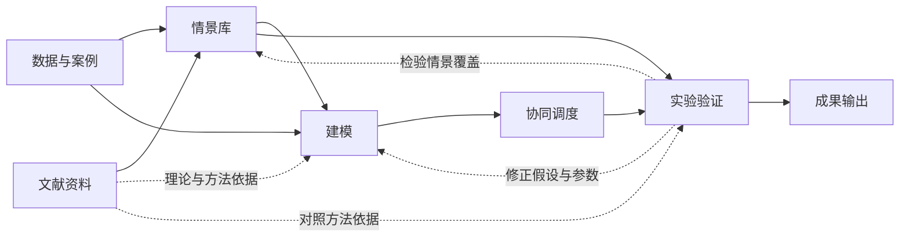

# 虹桥枢纽应急协同调度研究

课题：突发事件下超大规模交通枢纽多方式协同联动策略。

2026年10月10日最新重点：**情景库建立及原定分级方法的可行性**。保留五维主线，审查原Λ，并以固定参考资源包的候选规则开展解析与假设检验。总体仍面向虹桥突发事件下多方式协同疏运，涵盖白天、夜间与跨日。公开资料支持案例和约束，假设输入支持方法性质检查，实际参数尚未校准。先读[阶段研究报告](07_成果输出/阶段研究报告-2026-10-10.md)与[分级方法可行性论证](03_情景库/原定分级方法可行性论证-v2.md)；[决策记录](项目管理/阶段收尾与决策记录-2026-10-10.md)保留历次答复及最新纠偏。

本仓库按课题的研究模块组织：文献和案例提供依据，情景库定义研究场景，建模表达供需与约束，协同调度形成策略，实验验证比较效果，成果输出汇总最终作品。任务安排和过程记录集中放在项目管理中。

## 课题完成流程



## 项目结构

```text
jiaokesai/
├─ 01_文献资料/       政策预案、分级标准、学术文献与研究综述
├─ 02_数据与案例/     真实事件、客流与运力数据、参数口径
├─ 03_情景库/         情景维度、危害约束、分级判据与情景生成
├─ 04_建模/           需求积压、运力能力、到位时间、变量与约束
├─ 05_协同调度/       多方式策略、联动权限、资源配置与求解
├─ 06_实验验证/       对照方案、情景实验、敏感性分析与结果评价
├─ 07_成果输出/       作品说明书、研究报告、图表及答辩材料
├─ 项目管理/          分工、排期、导师意见、评审与修订记录
└─ 历史归档/          WorkBuddy原稿、仓库初始文件及校验记录
```

## 模块入口与当前进展

| 模块 | 输入与研究内容 | 向下一模块提供 | 当前进展 |
|---|---|---|---|
| [文献资料](01_文献资料/README.md) | 政策、预案、标准及已有方法 | 研究边界、指标依据、方法对照 | 8篇情景方法对照、11篇代表综述及关键文献补核；清单存在重叠，部分全文待取得 |
| [数据与案例](02_数据与案例/README.md) | 事件记录、客流、服务能力、方向与时间 | 情景参数、模型输入、检验样本 | 补航空转场、台风方式限制及2026网络；事件、对照、计划、演练分列，量化日志仍缺 |
| [情景库](03_情景库/README.md) | 运营冲击、危害信息与需求能力条件 | 可追溯的情景定义及生成规则 | 五维审查、原Λ反例、修正分级原型；真实材料卡作为字段与边界支撑 |
| [建模](04_建模/README.md) | 情景、需求、能力及到位时间 | 数学关系、目标、约束与参数接口 | 字段框架齐备；简化队列仅用于分级原型检验，尚未实际校准 |
| [协同调度](05_协同调度/README.md) | 模型、资源与权限条件 | 各方式准备、动员与疏运策略 | 条件化动作接口齐备；无求解结果或执行授权 |
| [实验验证](06_实验验证/README.md) | 情景集、策略及独立事件 | 效果比较、稳健性与适用边界 | 10张假设卡、120组配置及14类性质检查；真实独立验证未完成 |
| [成果输出](07_成果输出/README.md) | 各模块研究材料与确认状态 | 阶段报告、后续说明书和答辩材料 | 阶段内容已汇总，供团队与导师审阅 |

## 当前优先阅读

- [阶段研究报告](07_成果输出/阶段研究报告-2026-10-10.md)
- [分级原型验证记录](06_实验验证/分级方法验证/验证说明.md)
- [描述性情景卡集](03_情景库/描述性情景卡集-v1.md)与[覆盖矩阵](03_情景库/情景覆盖矩阵-v1.md)
- [数据字典与方法框架](04_建模/数据字典与方法框架-v1.md)、[协同动作接口](05_协同调度/情景到协同动作接口-v1.md)
- [阶段验收与后续验证](06_实验验证/描述性情景库验收与后续验证方案-v1.md)
- [新增关键文献核查](01_文献资料/新增关键文献核查-2026-10-10.md)
- [情景库构建方案](03_情景库/枢纽情景库构建方案v1-文献论证稿-优化版.md)
- [突发事件定义与研究边界](03_情景库/突发事件定义与研究边界.md)
- [超大型综合交通枢纽判定与适用边界](03_情景库/超大型综合交通枢纽判定与适用边界.md)
- [多方式划分与纳入规则](03_情景库/多方式划分与纳入规则.md)
- [协同联动定义与方法](03_情景库/协同联动定义与方法.md)
- [课题关键词界定表](01_文献资料/课题关键词界定表.md)
- [梅玉坤任务补强与交叉复核记录](项目管理/梅玉坤任务补强与交叉复核记录.md)
- [灾害分级文献体系对照表](01_文献资料/灾害分级文献体系对照表-优化版.md)
- [虹桥案例口径核查](02_数据与案例/虹桥案例口径核查.md)
- [万岩松任务安排](项目管理/万岩松任务优化版.md)与[三人分工方案](项目管理/国庆七天三人分工方案-优化版.md)

2026年10月1—7日排期作为历史计划保留。当前完成原定分级方法审查及候选原型的条件性检验；后续优先确认服务目标、参考包和实际检验数据。

## 研究版本说明

原稿Λ公式及1/3/8阈值停止采用；到达人数、滞留人数和运输人次分别记录。候选F0-F3为研究内部资源层，仅在明示参考包和目标下解释，尚未成为虹桥实际分级标准。T-A3、T-A6、T-B和T-C继续按分工推进，团队评审与人工复核状态如实记录。

网络补证保留为辅助材料；阶段报告已围绕分级可行性重写，另生成并检查[报告PDF](07_成果输出/阶段研究报告-2026-10-10.pdf)。取得2022总体预案全文，后续适用版及专项仍待核。

当前修订文本采用Markdown，原始Word保留在历史归档。工作区10月10日Word转换稿尚未通过逐页版式检查，且未包含本次收尾修改。引用、假设、未完成条件及修改依据见[复查与修订记录](项目管理/复查与修订记录.md)。
