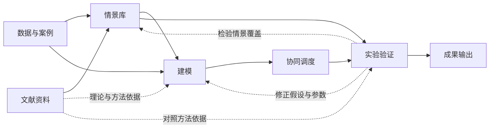

# 虹桥枢纽应急协同调度研究

课题：突发事件下超大规模交通枢纽多方式协同联动策略。

本仓库按课题的研究模块组织：文献和案例提供依据，情景库定义研究场景，建模表达供需与约束，协同调度形成策略，实验验证比较效果，成果输出汇总最终作品。任务安排和过程记录集中放在项目管理中。

## 课题完成流程



## 项目结构

```text
jiaokesai/
├─ 01_文献资料/       政策预案、分级标准、学术文献与研究综述
├─ 02_数据与案例/     真实事件、客流与运力数据、参数口径
├─ 03_情景库/         情景维度、危害约束、分级判据与情景生成
├─ 04_建模/           需求积压、运力能力、到位时间、变量与约束
├─ 05_协同调度/       多方式策略、联动权限、资源配置与求解
├─ 06_实验验证/       对照方案、情景实验、敏感性分析与结果评价
├─ 07_成果输出/       作品说明书、研究报告、图表及答辩材料
├─ 项目管理/          分工、排期、导师意见、评审与修订记录
└─ 历史归档/          WorkBuddy原稿、仓库初始文件及校验记录
```

## 模块入口与当前进展

| 模块 | 输入与研究内容 | 向下一模块提供 | 当前进展 |
|---|---|---|---|
| [文献资料](01_文献资料/README.md) | 政策、预案、标准及已有方法 | 研究边界、指标依据、方法对照 | 分级对照已有修订稿，部分原文待核 |
| [数据与案例](02_数据与案例/README.md) | 事件记录、客流、服务能力、方向与时间 | 情景参数、模型输入、检验样本 | 已有一个案例口径核查示例，完整数据待补 |
| [情景库](03_情景库/README.md) | 运营冲击、危害信息与需求能力条件 | 可追溯的情景定义及生成规则 | 八节论证稿已修订，阈值与覆盖待验证 |
| [建模](04_建模/README.md) | 情景、需求、能力及到位时间 | 数学关系、目标、约束与参数接口 | 待路线确认后开展，尚无模型实现 |
| [协同调度](05_协同调度/README.md) | 模型、资源与权限条件 | 各方式准备、动员与疏运策略 | 待开展，尚无求解结果 |
| [实验验证](06_实验验证/README.md) | 情景集、策略及独立事件 | 效果比较、稳健性与适用边界 | 待开展，尚无实验结果 |
| [成果输出](07_成果输出/README.md) | 各模块经确认的研究结果 | 最终说明书、报告和答辩材料 | 待汇总定稿 |

## 当前优先阅读

- [情景库构建方案](03_情景库/枢纽情景库构建方案v1-文献论证稿-优化版.md)
- [灾害分级文献体系对照表](01_文献资料/灾害分级文献体系对照表-优化版.md)
- [虹桥案例口径核查](02_数据与案例/虹桥案例口径核查.md)
- [万岩松任务安排](项目管理/万岩松任务优化版.md)与[三人分工方案](项目管理/国庆七天三人分工方案-优化版.md)

2026年10月1—7日仍为文献调研与方案论证阶段。建模、协同调度、实验和成果目录已建立，用于承接整个课题，实际工作按团队和导师确认的路线推进。

## 研究版本说明

原稿Λ公式及1/3/8阈值停止采用；到达人数、滞留人数和运输人次分别记录。情景库尚未建立有效的绝对分级标准。T-A3、T-A6、T-B和T-C继续按分工推进，团队评审与人工复核状态如实记录。

当前修订文本采用Markdown，原始Word保留在历史归档。Word优化稿尚未通过逐页版式检查。引用、假设、未完成条件及修改依据见[复查与修订记录](项目管理/复查与修订记录.md)。
