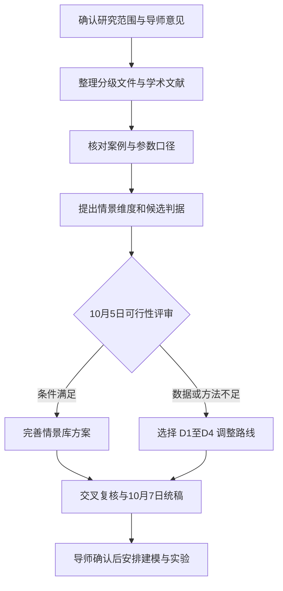

# 虹桥枢纽应急协同调度研究

课题：突发事件下超大规模交通枢纽多方式协同联动策略。当前阶段为 **2026 年 10 月 1—7 日的文献调研与方案论证**。先检验情景库的证据、变量与适用边界，再由团队和导师决定后续建模路线。

## 从这里开始

1. 阅读 [三人分工方案](docs/01_任务安排/国庆七天三人分工方案-优化版.md)，了解阶段目标与责任。
2. 按 [三人分工表](docs/01_任务安排/国庆七天三人分工表-优化版.md) 和 [万岩松任务安排](docs/01_任务安排/万岩松任务优化版.md) 推进工作。
3. 查阅 [分级文献对照表](docs/02_文献证据/灾害分级文献体系对照表-优化版.md) 与 [案例口径核查](docs/02_文献证据/虹桥案例口径核查.md)。
4. 阅读 [情景库构建方案](docs/03_情景库方案/枢纽情景库构建方案v1-文献论证稿-优化版.md)。
5. 使用 [导师问题卡与评审记录](docs/04_评审与交付/导师问题卡与评审记录.md)，在 10 月 5 日确定路线。

## 目录与用途

| 目录 | 用途 |
|---|---|
| `docs/01_任务安排` | 总方案、三人责任、万岩松逐日任务 |
| `docs/02_文献证据` | 分级文件、来源状态、案例数据边界 |
| `docs/03_情景库方案` | 问题论证、维度设计、判据与校准方案 |
| `docs/04_评审与交付` | 决策表、导师问题卡、修订记录与验收 |
| `archive/WorkBuddy原稿` | 原始 Word 文件，供追溯比较 |

后续只有在相应阶段启动后，才增加数据、模型、实验和最终作品目录；当前目录中的流程图不代表这些阶段已经完成。

## 当前结论

已修订万岩松负责的 T-A1、T-A2、T-A4、T-A5，并统一任务接口。原稿的 Λ 分级公式及 1/3/8 阈值停止采用；到达人数、滞留人数与运输人次分别记录。情景库仍是待验证的研究方案，尚不能宣称已建立有效的绝对分级标准。

T-A3 学术对比、T-A6 情景生成、T-B 关键词及 T-C 背景综述仍按分工由相应成员推进。本次没有代填其完成状态，也没有作出 10 月 5 日的团队决定。

## 版本规则

本次修订的阅读入口为 `docs` 中的 Markdown 文件。原始 Word 文件保留在 `archive`，其中未经核实的公式、阈值和结论不能继续作为当前方案依据。Word 优化稿尚未通过分页与版式渲染检查，不纳入本次正式提交。

每条引用注明原文链接、适用对象和核验范围；研究推论与假设单独标明。修改背景和未完成条件见 [复查与修订记录](docs/04_评审与交付/复查与修订记录.md)。
